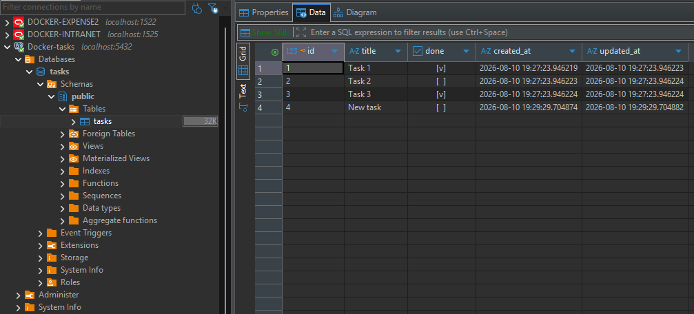
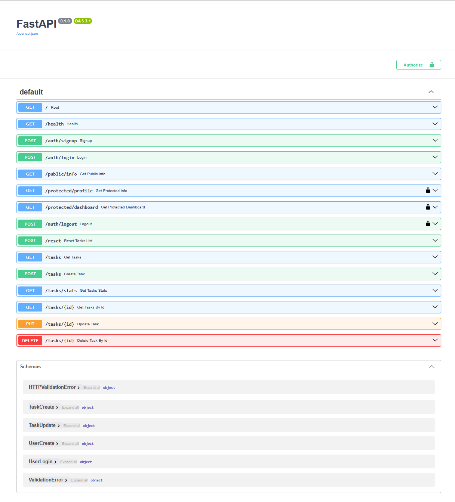

# Task API

FastAPI + Supabase Auth CRUD to-do list with PostgreSQL + docker, done as an exercise for the AI Back-end track.

## Requirements

- Python 3.10+
- Docker application
- Supabase account

## Database

PostgreSQL was chosen as it is one of the most used database management systems around the world. And for preventing environment running issues, we're pairing it with docker for an efficient solution. Supabase was chosen as an Identity Provider, acting as a middleman and managing accounts and issuing JWTs.

The database open in DBeaver:


## Environment files
Run this command to copy .env.example as .env

```bash
cp .env.example .env
```

Then update the relevant data for the DB name, password, and add it to the URL. Also update the data regarding your supabase project URL (SUPABASE_URL) and anon key (SUPABASE_KEY), and PORT. Don't type in your service_role, it bypasses all security. 

On the Dashboard, disable 'Confirm email', so you are able to fresh login immediately.

Compose injects `DATABASE_URL` with host `db` for the `api` service; for local uvicorn use `localhost` in `.env`.

With Docker, open http://localhost:8008 (maps to 8000 in the container).

## Install & run (docker)

```bash
docker compose up -d --build
```

## Install & run (locally)

```bash
python -m venv .venv
source .venv/Scripts/activate
pip install -r requirements.txt
uvicorn main:app --reload --port 8008
```

Then open:

- API: http://localhost:8008
- Swagger UI: http://localhost:8008/docs

## Endpoints

| Method | Path | Description | Auth Needed |
|--------|------|-------------|-------------|
| GET | `/` | API info (name, version, endpoints) | No |
| POST | `/auth/signup` | Creates a user requiring email and password | No |
| POST | `/auth/login` | Login into a user requiring email and password | No |
| POST | `/auth/logout` | Logout of a user requiring Bearer access token | Bearer |
| GET | `/protected/profile` | Checks a logged in user id, email, and creation date requiring Bearer access token | Bearer |
| GET | `/protected/dashboard` | Checks a logged in user id and email requiring Bearer access token | Bearer |
| GET | `/public/info` | Open welcome message | No |
| GET | `/health` | Health check | No |
| POST | `/reset` | Restore the 3 seed tasks | No |
| GET | `/tasks` | List all tasks (?done=true|false, ?search=...) | No |
| GET | `/tasks/stats` | Counts: total, done, pending | No |
| GET | `/tasks/{id}` | Get a task by ID | No |
| POST | `/tasks` | Create a new task | No |
| PUT | `/tasks/{id}` | Update a task | No |
| DELETE | `/tasks/{id}` | Delete a task | No |

## Example Auth (signup / login / profile)

Sign-up
```bash
curl -i -X POST http://localhost:8008/auth/signup -H "Content-Type: application/json" -d "{\"email\":\"test@example.com\",\"password\":\"password123\"}"
```

Login
```bash
curl -i -X POST http://localhost:8008/auth/login -H "Content-Type: application/json" -d "{\"email\":\"test@example.com\",\"password\":\"password123\"}"
```

Get profile information
```bash
curl -i http://localhost:8008/protected/profile -H "Authorization: Bearer PASTE_ACCESS_TOKEN"
```


## Example Tasks

```bash
curl -i http://localhost:8008/tasks
```

```
HTTP/1.1 200 OK
date: Tue, 11 Aug 2026 00:09:03 GMT
server: uvicorn
content-length: 116
content-type: application/json

[{"id":1,"title":"Task 1","done":true},{"id":2,"title":"Task 2","done":false},{"id":3,"title":"Task 3","done":true}]
```

## Swagger UI



## AI rematch (`ai-version/`)

Bonus Stage 7: the same Task API regenerated by an AI assistant, kept in quarantine under `ai-version/` so the hand-built `main.py` stays untouched.

- **A1** — in-memory rematch (first prompt).
- **A2** — SQLite rematch (second prompt).
- **A3** — PostgreSQL + psycopg + Docker rematch (third prompt; `ai-version/main.py` now matches this stage).

### Run the AI version

Docker (recommended for A3):

```bash
cd ai-version
cp .env.example .env
docker compose up -d
```

- API: http://localhost:8002
- Swagger UI: http://localhost:8002/docs
- Postgres (host): `localhost:5434`

Local uvicorn (needs Postgres reachable via `DATABASE_URL` in `ai-version/.env`):

```bash
source .venv/Scripts/activate
cd ai-version
pip install -r requirements.txt
uvicorn main:app --reload --port 8002
```

### A1

#### Prompt used

```
Goal: You'll build an API that manages a to-do list, by creating tasks, reading, updating, and deleting them. Then update the README to contain what you have done, apart from the current contents of the readme, meaning you'll only add.

Description: You'll do it using FastAPI, meaning it comes already with swagger documentation, but you'll add one-line descriptions to it. The project is already set on github, so you'll only have to commit. You'll be limited to changing only files inside "ai-version/" folder, for the exception of README.md. No database will be used, only in-memory.

The task:
Create 5 main calls, GET for all tasks and each task, a POST for creating a task, a PUT for updating a task, and a DELETE for deleting a task.

But also create GETs for health check and api info.

Make error exceptions properly, as in, 201 when creating, 200 when getting, 404 if unknown id. 400 for bad requests as missing data.

Feel free to add extras such as filtering by query parameters, searching with query parameters, and a post to reset all tasks to their original state.
```

#### AI vs me

**What the AI did better**
- Uses `HTTPException` + small helpers (`_find_task`, `_next_id`) instead of repeating loops and `JSONResponse` in every route — easier to read and harder to mistype a status code.
- DELETE returns a real **204 with an empty body** (`Response(status_code=204)`). My hand-built version declared `status_code=204` but still tried to send a JSON message body, which fights the meaning of 204.
- `_next_id()` safely handles an empty list after every task is deleted. My version would crash on `max(...)` if `tasks` were empty.

**What it got wrong or decided differently**
- Error JSON is wrapped as `{"detail": {"error": "..."}}` because FastAPI's `HTTPException` always puts the payload under `detail`. My hand-built API returns the flatter `{"error": "..."}` that the assignment examples show.
- The prompt did not mention a stats endpoint; the AI still added `GET /tasks/stats` (same extra I had built by hand). It also chose port **8001** in the README so both servers can run side by side — that was never specified.

**What the prompt forgot to specify**
- Exact error body shape (`{"error": "..."}` vs FastAPI's `detail` wrapper), seed task titles, and whether DELETE must return an empty body. One rematch takeaway: name the response contract as precisely as the status codes, or the AI will fill the gaps with framework defaults.

**One rematch note:** tightening the prompt around "404 body must be exactly `{ \"error\": \"Task N not found\" }` with no `detail` wrapper" and "204 must have zero body" would close the two biggest silent diffs.

#### Prompt rating: 7/10

Solid for a first rematch prompt — clear enough to get a working API, not precise enough to lock the response contract.

**What the prompt got right**
- Scope quarantine: `ai-version/` only (+ README append) — the most important Stage 7 constraint.
- Stack + storage: FastAPI, in-memory, no DB — no room for the AI to invent a database.
- CRUD + status codes: 201 / 200 / 404 / 400 named explicitly.
- Swagger note: one-line descriptions — shows docs come from the code.
- Extras as optional: "feel free" keeps stretch goals from becoming mandatory noise.

**Where it was weak**
- Paths never named. Said "GET for all tasks" but not `GET /tasks` or `GET /tasks/{id}` — an AI could invent `/todos` or `/api/v1/tasks`. It matched by luck/training, not because the prompt forced it.
- Error body shape missing. Status codes without payload shape = incomplete API contract (hence FastAPI's `detail` wrapper).
- DELETE incomplete: no `204` + empty body required.
- Validation rules fuzzy: missing title vs empty string `""` vs whitespace-only vs PUT with `{}`.
- Seed data unspecified: "original state" for `/reset` needs the 3 seed tasks defined.
- Process mixed with product: commit instructions belong in workflow, not in the API spec.
- Root/health payloads unspecified (`Task API` / `{ "status": "ok" }`).

**If only one paragraph could be rewritten to raise this to a 9:** the paths. Without exact URLs, the whole contract floats — that is the main purpose of the task.

### A2

#### Prompt used

```
Goal: You'll build an API that manages a to-do list, by creating tasks, reading, updating, and deleting them. Then update the README to contain what you have done, apart from the current contents of the readme, meaning you'll only add.

Description: You'll do it using FastAPI, meaning it comes already with swagger documentation, but you'll add one-line descriptions to it. The project is already set on github, so you'll only have to commit. You'll be limited to changing only files inside "ai-version/" folder, for the exception of README.md. You'll use SQLite3, which already comes with FastApi

The task:
Create 5 main calls, GET /tasks and GET/tasks{id}, a POST for creating a task, a PUT for updating a task, and a DELETE for deleting a task.

The jsons must follow this JSON pattern: { "key": "value" }

Here's a seed for you to follow on how I want the data:
"
    {"id": 1, "title": "Task 1", "done": True, "created_at": datetime.now(), "updated_at": datetime.now()},
    {"id": 2, "title": "Task 2", "done": False, "created_at": datetime.now(), "updated_at": datetime.now()},
    {"id": 3, "title": "Task 3", "done": True, "created_at": datetime.now(), "updated_at": datetime.now()},
"

But also create GETs for health check and api info.

Health should return status, and api info as much info as you like without being verbose

Make error exceptions properly, as in, 201 when creating, 200 when getting, 404 if unknown id. 400 for bad requests as missing data, 204 when deleting.

Feel free to add extras such as filtering by query parameters, searching with query parameters, and a post to reset all tasks to their original state.

For the reset, if done, you have the default tasks above.

You'll also have another small task which is, in the readme, you'll create a section for A1 and A2, separate from ###Prompt used and below to inside A1, and make the same thing done there for A2 but regardind all the new data.
```

#### AI vs me

**What the AI did better**
- `/reset` actually clears and re-seeds **SQLite** (including `sqlite_sequence` so IDs go back to 1–3). The hand-built `/reset` only rewrote the leftover in-memory list and left `tasks.db` untouched.
- `/tasks/stats` reads counts from the database. The hand-built stats endpoint still summed the in-memory list after the CRUD moved to SQLite.
- PUT checks that the row exists and returns **404** before updating. The hand-built PUT would blow up (or update nothing useful) if the id was missing.
- Keeps A1 habits that still help with a DB: `HTTPException`, real empty-body **204**, and `summary=` one-liners for Swagger.

**What it got wrong or decided differently**
- Same A1 `detail` wrapper: errors look like `{"detail": {"error": "..."}}` instead of the flatter `{"error": "..."}` from the hand-built API.
- `created_at` / `updated_at` are stored in SQLite (as the seed suggests) but not returned in JSON responses — same product choice as the hand-built API / README note, not a prompt-forced contract.
- Added `GET /tasks/stats` again even though A2 did not require it (same stretch as A1).

**What the prompt forgot to specify**
- Whether timestamps must appear in API responses or only in the DB.
- Exact error body shape (still the biggest silent contract gap from A1).
- Where `tasks.db` should live (`ai-version/` vs project root) when both servers can run.

**One rematch note:** saying "persist with SQLite; API JSON is `{id, title, done}` only; timestamps stay in the DB" would remove the biggest A2 ambiguity.

#### Prompt rating: 8/10

Stronger than A1 because paths, seed data, SQLite, and **204** are explicit — the main A1 failure mode is mostly fixed.

**What the prompt got right**
- Named routes: `GET /tasks` and `GET /tasks/{id}` (typo aside) lock the URL contract.
- Seed with ids/titles/done + timestamps gives `/reset` a real target.
- Storage constraint flipped clearly: SQLite instead of in-memory.
- DELETE **204** called out this time.
- README structure task (A1 / A2) keeps the rematch write-up organized.

**Where it was weak**
- Path typo: `GET/tasks{id}` missing `/` and braces style — still readable, still sloppy for a contract.
- Error payload shape still missing (`error` vs `detail`).
- Timestamp visibility in responses unspecified.
- "JSON pattern `{ \"key\": \"value\" }`" is too vague to constrain field names/types beyond the seed.
- Commit / README formatting mixed into the product prompt again.

**If only one paragraph could be rewritten to raise this to a 9:** lock the response contract — status codes **and** body shapes for 400/404/201, plus whether timestamps are public fields.

### A3

#### Prompt used

```
Goal: You'll build an API that manages a to-do list, by creating tasks, reading, updating, and deleting them. Then update the README to contain what you have done, apart from the current contents of the readme, meaning you'll only add.

Description: You'll do it using FastApi + psycopg, with connection from DATABASE_URL, it comes already with swagger documentation, but you'll add one-line descriptions to it. You'll be limited to changing only files inside "ai-version/" folder, for the exception of README.md. You'll containerize it all, through docker.

The task:
Create 5 main calls, GET /tasks and GET /tasks/{id}, a POST for creating a task, a PUT for updating a task, and a DELETE for deleting a task.

The jsons must follow this JSON pattern: { "id": "<int>", "title": <string>, "done": boolean }

POST /tasks body: { "title": "<string>" }  (done defaults to false)
PUT /tasks/{id} body: any of { "title": "...", "done": true|false } (partial update allowed)
List endpoint returns an array of Task resources.

Here's a seed for you to follow on how I want the data:
"
    {"id": 1, "title": "Task 1", "done": True, "created_at": datetime.now(), "updated_at": datetime.now()},
    {"id": 2, "title": "Task 2", "done": False, "created_at": datetime.now(), "updated_at": datetime.now()},
    {"id": 3, "title": "Task 3", "done": True, "created_at": datetime.now(), "updated_at": datetime.now()},
"

As you can see, every entry has timestamps, but we don't need to see them in API responses.

But also create GETs for health check and api info.

Health should return status, and api info as much info as you like without being verbose

Errors must be returned as a flat JSON object with exactly this shape:
{ "error": "<message>" }

Do NOT wrap it in FastAPI's default { "detail": ... }.
If you use HTTPException, ensure the client still sees { "error": "..." } at the top level
(or avoid HTTPException and return JSONResponse with that body).
Examples:
- 404 → { "error": "Task not found" }
- 400 → { "error": "Title is required." }

Feel free to add extras such as filtering by query parameters, searching with query parameters, and a post to reset all tasks to their original state.

For the reset, if done, you have the default tasks above.

Documentation:
Append an A3 section to README with Prompt used / AI vs me, and repeat what was done there for A3, but regarding all the new data. The project is already set on github, so you'll only have to commit.
```

#### AI vs me

**What the AI did better**
- Fixed the A1/A2 `detail` wrapper with an `HTTPException` handler so clients get flat `{"error": "..."}` while routes still use `raise HTTPException(...)`.
- Quarantined a full Docker stack under `ai-version/` (`Dockerfile`, `docker-compose.yml`, `requirements.txt`, `.env.example`) on port **8002** / Postgres **5434**, so it does not collide with the hand-built compose on 8008/5432.
- Uses `RETURNING` on insert/update and `TRUNCATE ... RESTART IDENTITY` on reset — cleaner than re-querying after every write.
- Prompt finally named the JSON contract (`id` / `title` / `done`) and said timestamps stay out of responses; the AI followed that instead of guessing.

**What it got wrong or decided differently**
- Still added `GET /tasks/stats` as a stretch (same as A1/A2 / hand-built).
- 404 message is the prompt's generic `"Task not found"` — the hand-built API uses `"Task {id} not found"`.
- Seed inserts explicit ids on first boot + `setval`; reset inserts without ids after `TRUNCATE`. Both end at 1–3, but the paths differ from the hand-built "always insert titles only" style.
- `init_db()` still runs at import time (same fragility as the hand-built app if Postgres is down when uvicorn starts).

**What the prompt forgot to specify**
- Host ports for the AI Docker stack (8002/5434 were chosen to avoid clashing with the root compose).
- Whether 404 should include the missing id in the message.
- Whether `ai-version` should share the root Postgres or bring its own container/volume.

**One rematch note:** once error shape, response fields, and storage are locked, the next biggest gap is **ops contract** — ports, env var names, and whether Docker lives next to the hand-built stack or replaces it.

#### Prompt rating: 9/10

Best rematch prompt so far: storage, paths, body shapes, timestamps, and the flat error contract are all explicit.

**What the prompt got right**
- Stack locked: FastAPI + psycopg + `DATABASE_URL` + Docker, still quarantined to `ai-version/` (+ README append).
- Resource JSON and request bodies named field-by-field (including partial PUT).
- Timestamps: present in seed/DB, absent from API responses — closes the A2 ambiguity.
- Error contract finally fixed: flat `{"error": "..."}` with examples, plus how to keep using `HTTPException`.
- README task (A3 mirror of A1/A2 write-up) keeps the rematch diary consistent.

**Where it was weak**
- Docker topology left open (own compose vs reuse root `db` service).
- DELETE status/body not restated (A2 had **204**; A3 relies on prior habit).
- Commit instruction still mixed into the product prompt.
- Stats / filter / search remain "feel free" extras — fine, but they keep drifting into every rematch.

**If only one paragraph could be rewritten to raise this to a 10:** spell the ops contract — `ai-version/docker-compose.yml`, published ports, and `DATABASE_URL` host (`db` in Compose / `localhost` locally).

### A4

Fourth rematch: same Task API plus Supabase auth. `ai-version/main.py` now matches this stage. Ports **8050** (API) and **5440** (Postgres); volume/container **`ai-version`**.

```bash
cd ai-version
cp .env.example .env
# fill SUPABASE_URL and SUPABASE_KEY (same values as the root .env)
docker compose up -d --build
```

- API: http://localhost:8050
- Swagger UI: http://localhost:8050/docs
- Postgres (host): `localhost:5440`

#### Prompt used

```
Goal: You'll build an API with Authentication, that manages a to-do list, by creating tasks, reading, updating, and deleting them. Then update the README to contain what you have done, apart from the current contents of the readme, meaning you'll only add.

Stack: FastApi + psycopg + supabase, with connection from DATABASE_URL. Swagger is included; add one-line description to each endpoint.

Scope: Change only files inside "ai-version/" folder, for the exception of README.md. Containerize with docker.

The task:
Create an authentication system using Supabase, with 6 calls, POST /auth/signup, POST /auth/login, POST /auth/logout, GET /protected/profile, GET /profile/dashboard, and GET /public/info. They are independent from the next main calls.

Create 5 main calls, GET /tasks and GET /tasks/{id}, a POST for creating a task, a PUT for updating a task, and a DELETE for deleting a task.

For the information regarding supabase URL and KEY, use the one provided by me, in this case, look at my .env file.

For Docker, you'll use ports 8050 and 5440 to avoid clashing with other composes.

For Postgres, you'll bring you own container/volume, called ai-version. If there's a current one, feel free to remove it completely to create the new one.

The jsons must follow this JSON pattern: { "id": "<int>", "title": <string>, "done": boolean }

POST /tasks body: { "title": "<string>" }  (done defaults to false)
PUT /tasks/{id} body: any of { "title": "...", "done": true|false } (partial update allowed)
List endpoint returns an array of Task resources.

DELETE /tasks{id} status 204, body: {No Content}

Here's a seed for you to follow on how I want the data:
"
    {"id": 1, "title": "Task 1", "done": True, "created_at": datetime.now(), "updated_at": datetime.now()},
    {"id": 2, "title": "Task 2", "done": False, "created_at": datetime.now(), "updated_at": datetime.now()},
    {"id": 3, "title": "Task 3", "done": True, "created_at": datetime.now(), "updated_at": datetime.now()},
"

As you can see, every entry has timestamps, but we don't need to see them in API responses.

But also create GETs for health check and api info.

Health should return status, and api info as much info as you like without being verbose

Errors must be returned as a flat JSON object with exactly this shape:
{ "error": "<message>" }

Do NOT wrap it in FastAPI's default { "detail": ... }.
If you use HTTPException, ensure the client still sees { "error": "..." } at the top level
(or avoid HTTPException and return JSONResponse with that body).
Examples:
- 404 → { "error": "Task {id} not found" }
- 400 → { "error": "Title is required." }

Feel free to add extras such as filtering by query parameters, searching with query parameters, and a post to reset all tasks to their original state.

For the reset, if done, you have the default tasks above.
```

#### AI vs me

**What the AI did better**
- Closed the A3 ops gap: compose publishes **8050** / **5440**, names the Postgres container and volume `ai-version`, and injects `DATABASE_URL` with host `db` while `.env.example` keeps `localhost` for local uvicorn.
- `HTTPBearer(auto_error=False)` plus the existing flat `HTTPException` handler — missing/invalid tokens return **401** `{"error": "Access token required"}` instead of FastAPI's default **403** `{"detail": "Not authenticated"}`. My hand-built `HTTPBearer()` still falls into that default unless every caller sends a header.
- Also flattens `RequestValidationError` (empty/malformed bodies) to `{ "error": "..." }`. My version only flattened the routes I remembered to handle with `JSONResponse`.
- `init_db()` runs on FastAPI lifespan/startup, not at import time — the A3 note about crashing if Postgres is down when uvicorn starts is actually fixed here.
- Signup returns a small JSON dict (`id` / `email` / `created_at`) instead of dumping the raw Supabase `User` object, which is easier for clients and Swagger.
- 404 now matches the tightened example: `"Task {id} not found"`. A3 had followed the older generic `"Task not found"`.

**What it got wrong or decided differently**
- Dashboard path is **`GET /profile/dashboard`** because that is what the prompt wrote. My hand-built API uses **`GET /protected/dashboard`**. Same idea, different URL — a silent contract split if both servers are compared in Swagger.
- Still added `GET /tasks/stats` as a stretch (same extra as A1–A3 / hand-built).
- Tasks stay public (prompt said auth is independent of CRUD) — same product choice as the hand-built API, not a bug, but easy to misread as "the whole API is protected".
- Logout still calls `sign_out()` on the process-wide Supabase client (same shortcut I used). Fine for a lab; not a per-token revoke.

**What the prompt forgot to specify**
- Auth JSON bodies and responses: signup/login fields, whether login returns `access_token` + `refresh_token`, profile payload (`id` / `email` / `created_at`), and the exact 401 strings.
- Dashboard path vs the existing `/protected/dashboard` from Stages 1–5.
- Whether Swagger must expose Bearer auth (the AI added `HTTPBearer`, which is the useful default).

**One rematch note:** A3 asked for an ops contract and A4 delivered it (ports, volume name, own Postgres). The new hole is the **auth contract** — named routes without request/response shapes, plus one path that does not match the hand-built API.

#### Prompt rating: 9/10

A3's missing ops paragraph is now in the prompt. Auth routes are named. The remaining 1 point is still contract precision, just moved from Docker to login/profile JSON.

**What the prompt got right**
- Stack locked: FastAPI + psycopg + Supabase + `DATABASE_URL` + Docker, still quarantined to `ai-version/` (+ README append).
- Six auth paths named, and "independent from the next main calls" stops the AI from putting Bearer on CRUD by accident.
- Ops contract named this time: ports **8050** / **5440**, own Postgres container/volume `ai-version`, reuse root `.env` keys.
- Task JSON, partial PUT, timestamps hidden, flat `{ "error": "..." }`, and 404 with `{id}` all restated.
- DELETE **204** + empty body called out again (A3 had dropped it).

**Where it was weak**
- Dashboard typo/mismatch: `/profile/dashboard` vs the hand-built `/protected/dashboard`.
- Auth payloads unspecified (the A1 error-shape problem, now for signup/login/profile).
- Path typo on DELETE: `DELETE /tasks{id}` missing `/` — same class of slip as A2.
- Commit / README diary still mixed into the product prompt.
- Stats / filter / search remain "feel free" extras.

**If only one paragraph could be rewritten to raise this to a 10:** lock the auth JSON — signup/login body `{email, password}`, login response `{access_token, refresh_token}`, profile fields, 401 messages — and pick a single dashboard path (`/protected/dashboard`).
